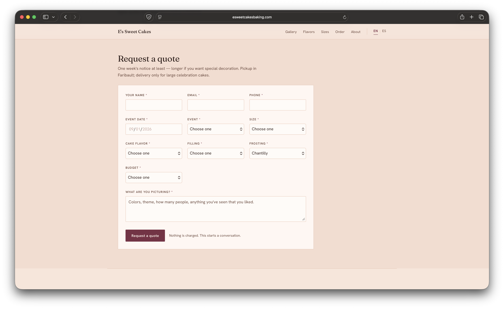
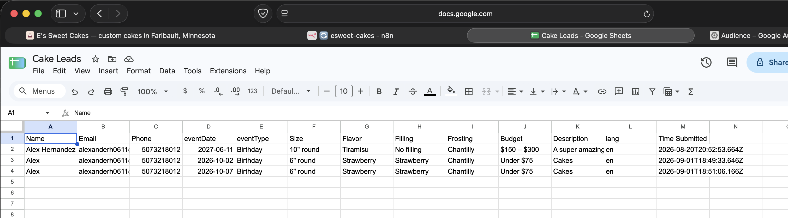
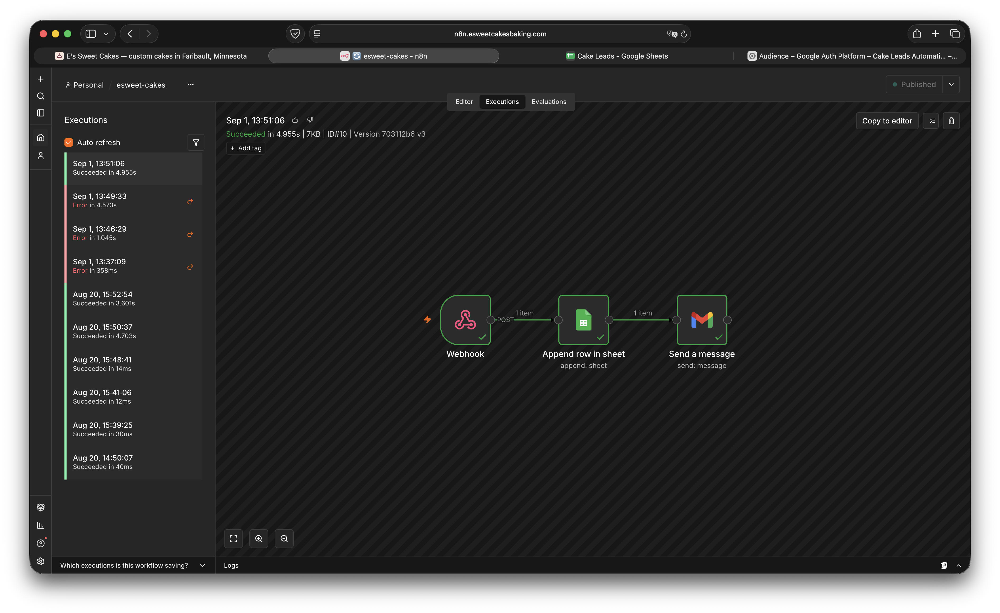

# Mom's Cakes Automation

https://esweetcakesbaking.com
Live since August 20, 2026.
## The Problem
My mother, Esperanza, has been baking cakes out of her kitchen in Faribault for 5 years now. She takes around 4-8 orders each week. Before this, each order would get to her through Facebook messages or mobile texts. There was also no record of anything. If she didn't see a message or didn't write down a day that someone asked about, the order would just disappear. She also couldn't go back and see what people had ordered in the past. 
## What I built
I built a website for her with a quote request form on it. Whenever someone submits a quote request, the request lands on her phone as a text and email, and it gets saved in a spreadsheet. She reads and replies to the customer the same day. 

Form -> Webhook -> Google Sheet -> Email and text to her

## What it does for her
Whenever someone is wondering about a specific cake or date, they fill out a quote request.
She gets a text within a few seconds of submission. It shows her the customer's name, what cake they want, when they need it, and their contact information. My mom can call or text them back whenever she gets the time to.

Each request also gets recorded in a Google Sheet with what the customer filled out: date, type, size, filling, budget, and what they are picturing. Even if she isn't free when she gets the email, she can go back to it whenever she needs to. 

(test submissions)

(test submissions landing on my mom’s phone as an email and text)
## How it's built
- Astro for the site
- Cloudflare for hosting the site and using a unique domain
- Hetzner server runs Docker, which runs n8n
- n8n has the automation and workflow
- The text comes from sending an email to her Verizon email to text address

## Things that went wrong 
Three big obstacles I faced during production:
- **Locked out of Hetzner server, no SSH access**
I had to get back into my Hetzner server so I could restart Docker. But I got stopped by a SSH authentication. My SSH key had a passphrase that I never wrote down, and I forgot my root password too. Gaining access again took me a while because Hetzner's console uses a Finnish keyboard, the passwords I would try and type in, would come out wrong. -> [[2026-08-19 Locked out of Hetzner server, no SSH access]]

- **n8n's Google login broke after I moved it to the Hetzner server**
After I moved n8n onto its own server, I had to reconnect Google credentials so I could use Sheets and Gmail with n8n. However, each time i'd try and sign in, the sign in was pointing at localhost instead of my new n8n domain. Google kept going back to my laptop instead of the server I set up. -> [[2026-08-19 n8n Google OAuth credential breaks on production]]

- **The live form failed silently**
On the live website hosted by Cloudflare, each time i'd try and submit the request form, the site would shoot back with "That didn't go through," but it didn't point out any error and nothing popped up back on n8n. After doing some troubleshooting, I found out that the webhook address didn't appear at all in the live site. This was because it was on my .env file and those aren't shown on GitHub. Cloudflare gets its data from GitHub, meaning it never hosted the .env file because it was never there to begin with. -> [[2026-08-20 Live form silently fails]]
## What I learned
A good thing I learned was the difference in something working on my machine, and something working for all machines. I had the entire thing on my mac at first, and each time I tested it on the mac it worked. But it wouldn't have ever worked for anyone else because it was hosted all on my laptop. I wrote this up in my concepts section: [[localhost vs. real world]]
## What's next
The system now works. What it doesn't have yet is people actively using it and sending requests. Not much people know about the site yet.

Next is putting her domain and a QR code on her business cards that takes you to the site. Whenever someone asks about a cake, she can hand out her card which the customer can then scan it. After that it's seeing if orders start coming in. 
